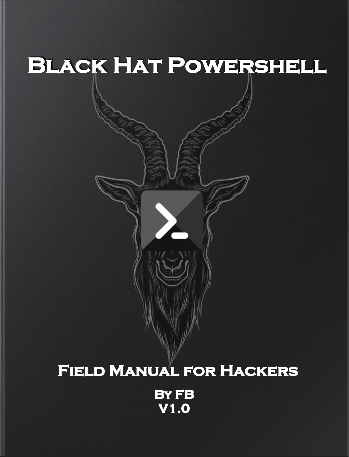

# Black Hat Powershell

A field manual for hackers.

## SharpHound.ps1
https://raw.githubusercontent.com/BloodHoundAD/BloodHound/master/Collectors/SharpHound.ps1

## Offensive Security Domain Enumeration Script
## Powershell Reverse Shell

### Powershell Reverse Shell Scripts

## References
- Useful Cheatsheet https://gist.github.com/jivoi/c354eaaf3019352ce32522f916c03d70
- Port scanning https://www.sans.org/blog/pen-test-poster-white-board-powershell-built-in-port-scanner/
- Powershell vs Bash https://mathieubuisson.github.io/powershell-linux-bash/
- Zipping files https://docs.microsoft.com/en-us/powershell/module/microsoft.powershell.archive/compress-archive?view=powershell-7.2
- Clearing Event Logs https://docs.microsoft.com/en-us/powershell/module/microsoft.powershell.archive/expand-archive?view=powershell-7.2

